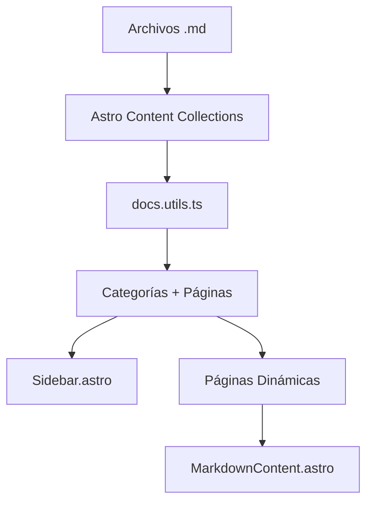

# MicroDocs - Sistema de Documentación Dinámica

Sistema de documentación técnica construido con Astro 5, diseñado para proyectos de microservicios. Genera automáticamente la estructura de navegación basándose en archivos Markdown organizados por carpetas.

## 🚀 Características

- **📁 Organización Automática**: Estructura de navegación generada dinámicamente desde carpetas
- **📝 Markdown Nativo**: Escribe documentación en Markdown con soporte completo
- **🎨 Diseño Moderno**: Interfaz limpia y legible con Tailwind CSS 4
- **⚡ Rendimiento**: SSR con Astro 5 para carga instantánea
- **🔍 Navegación Intuitiva**: Sidebar automático con categorías y páginas
- **📱 Responsive**: Optimizado para todos los dispositivos
- **🎯 TypeScript**: Tipado estricto para mayor confiabilidad

## 📋 Requisitos Previos

- **Node.js**: 18 o superior
- **npm** o **pnpm**

## 🛠️ Instalación
```bash
# Clonar el repositorio
git clone <url-repositorio>
cd microdocs

# Instalar dependencias
npm install
# o
pnpm install
```

## 🚦 Comandos Disponibles

| Comando | Acción |
|---------|--------|
| `npm run dev` | Inicia servidor de desarrollo en `localhost:4321` |
| `npm run build` | Construye el sitio para producción en `./dist/` |
| `npm run preview` | Previsualiza la build localmente |
| `npm run astro` | Ejecuta comandos CLI de Astro |

## 📂 Estructura del Proyecto
```
microdocs/
├── src/
│   ├── components/
│   │   ├── MarkdownContent.astro    # Estilos para contenido MD
│   │   ├── Sidebar.astro            # Navegación lateral
│   │   └── Welcome.astro            # Página de bienvenida
│   │
│   ├── content/
│   │   ├── getting-started/         # Categoría: Primeros Pasos
│   │   │   ├── introduction.md
│   │   │   └── installation.md
│   │   │
│   │   ├── guides/                  # Categoría: Guías
│   │   │   └── first-steps.md
│   │   │
│   │   ├── micro-servicios/         # Categoría: Microservicios
│   │   │   ├── backoffice.md
│   │   │   ├── service-backend.md
│   │   │   └── ...
│   │   │
│   │   └── config.ts                # Configuración de colecciones
│   │
│   ├── layouts/
│   │   ├── DocsLayout.astro         # Layout de documentación
│   │   └── Layout.astro             # Layout base
│   │
│   ├── pages/
│   │   ├── docs/
│   │   │   └── [...slug].astro      # Páginas dinámicas
│   │   └── index.astro              # Redirección automática
│   │
│   ├── types/
│   │   └── docs.types.ts            # Tipos TypeScript
│   │
│   ├── utils/
│   │   └── docs.utils.ts            # Utilidades para navegación
│   │
│   └── styles/
│       └── global.css               # Estilos globales Tailwind
│
├── public/                           # Archivos estáticos
├── astro.config.mjs                 # Configuración de Astro
├── package.json
├── tsconfig.json
└── README.md
```

## 📝 Crear Nueva Documentación

### 1. Agregar una nueva categoría

Crea una carpeta dentro de `src/content/`:
```bash
mkdir src/content/mi-categoria
```

### 2. Agregar páginas de documentación

Crea archivos `.md` dentro de la categoría:
```markdown
---
title: "Mi Título"
description: "Descripción de la página"
order: 1
draft: false
---

# Mi Título

Contenido de la documentación...
```

### 3. Frontmatter Disponible

| Campo | Tipo | Descripción |
|-------|------|-------------|
| `title` | `string` | Título de la página (requerido) |
| `description` | `string` | Descripción breve (opcional) |
| `order` | `number` | Orden en la navegación (opcional, default: 999) |
| `draft` | `boolean` | Ocultar página (opcional, default: false) |

## 🎨 Personalización de Estilos

### Colores Principales

Los colores se definen en `src/components/MarkdownContent.astro`:
```css
/* Color principal */
--primary: #0c0b58ff;

/* Color acento */
--accent: #f8cf76ff;

/* Gradientes */
background: linear-gradient(135deg, #0c0b58ff 0%, #1e40af 100%);
```

### Modificar el Sidebar

Edita `src/components/Sidebar.astro` para cambiar:
- Logo y título
- Colores de navegación
- Estilos hover

## 🏗️ Arquitectura del Proyecto

### Screaming Architecture

El proyecto sigue **Screaming Architecture**, donde la estructura grita su propósito:
```
content/          → Documentación organizada por dominio
components/       → Componentes reutilizables
layouts/          → Plantillas de página
types/            → Definiciones de tipos
utils/            → Lógica de negocio
```

### Flujo de Datos


## 🔧 Configuración Avanzada

### Agregar Nuevos Tipos de Contenido

Edita `src/content/config.ts`:
```typescript
const miColeccion = defineCollection({
  type: 'content',
  schema: z.object({
    title: z.string(),
    fecha: z.date(),
    // ... más campos
  }),
});

export const collections = {
  docs: docsCollection,
  miColeccion: miColeccion,
};
```

### Modificar Rutas

Edita `src/pages/docs/[...slug].astro` para cambiar el prefijo de URL o lógica de renderizado.

## 📊 Microservicios Documentados

El proyecto incluye documentación técnica completa para:

- **Backoffice**: Panel administrativo Angular
- **Cliente**: Vista de marcador en vivo
- **Backend (.NET)**: API REST principal
- **ETL Stack**: Replicación y transformación de datos
- **Reportería (PHP)**: Sistema de reportes analíticos
- **Observability**: Monitoreo con Prometheus + Grafana
- **Email Service (Go)**: Microservicio de correos
- **Import/Export (Java)**: Gestión de datos CSV/JSON

## 🚀 Despliegue

### Build de Producción
```bash
npm run build
```

El sitio se generará en `./dist/` listo para:
- Vercel
- Netlify
- GitHub Pages
- Cualquier hosting estático

### Variables de Entorno

No requiere variables de entorno por defecto. Todo el contenido es estático.


## 📄 Licencia

Este proyecto es de código abierto.

## 👥 Equipo

Proyecto desarrollado en la **Universidad Mariano Gálvez**  
Ingeniería en Sistemas - Tablero Deportivo

---

**Construido con Astro 5**